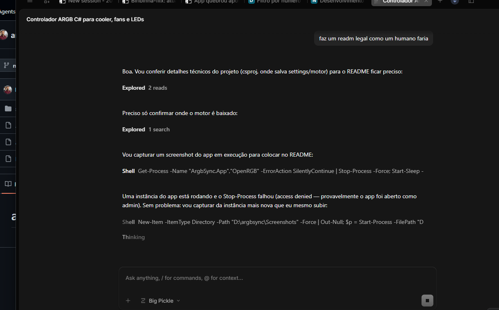

# ArgbSync

Controle a iluminação ARGB do seu PC de uma janela só, sem ficar abrindo o OpenRGB toda vez.

O ArgbSync é um app para Windows que conversa com o servidor SDK do OpenRGB e cuida de todo o resto: inicia o
motor embutido em segundo plano na primeira execução e mantém tudo funcionando — inclusive na bandeja.



## O que ele faz

- **Dispositivos em destaque** — cada placa/vídeo/cooler/strip vira um tile (valeu, SignalRGB), com filtro por tipo de hardware.
- **Cor sólida e brilho** — aplica em um dispositivo ou em todos, com um bando de cores rápidas ali do lado.
- **Efeitos do hardware** — os modos nativos (wave, cycle, static...) com velocidade, brilho e direção.
- **Zonas / Headers** — headers ARGB da placa-mãe nem sempre detectam o número certo de LEDs; ajuste o total e o app lembra (isolado para falar do seu cooler/fan/fita).
- **LED por LED** — para controladores que brilham LED a LED: pinta, arco-íris, aleatório ou apaga tudo.
- **Efeitos ao vivo** — arco-íris girando e respiração aplicados em todos os dispositivos de uma vez.
- **Perfis** — os perfis do OpenRGB, direto no app: salva, carrega e exclui.
- **Bandeja** — fechar a janela não fecha o app: ele fica na bandeja e continua rodando os efeitos.

## Como funciona

- O app pode **iniciar o OpenRGB sozinho** em segundo plano (servidor SDK na porta 6742) — a primeira execução
  baixa o motor embutido e depois disso funciona 100% offline.
- Ou você pode **conectar num servidor próprio**: abra o OpenRGB, ative o *SDK Server* e aponte o app.
- Configurações e o motor baixado ficam em `%APPDATA%\ArgbSync\` (`settings.json` e a pasta `runtime`).

## Requisitos

- Windows 10/11 (64 bits).
- Para usar o release zip: **nada** — é self-contained (o .NET já vai junto).
- Para compilar o código: [.NET 8 SDK](https://dotnet.microsoft.com/download/dotnet/8.0).

## Rodar sem compilar

Baixe o `ArgbSync-1.0.0-win-x64.zip` na página de [releases](https://github.com/ErikMartinsss-hub/argbsync/releases),
extraia e rode o `ArgbSync.App.exe`. A primeira execução baixa o OpenRGB embutido (uns segundos) e pronto.

## Compilar do código

```powershell
git clone https://github.com/ErikMartinsss-hub/argbsync.git
cd argbsync
dotnet build src\ArgbSync.App\ArgbSync.App.csproj -c Release
```

Para gerar o executável único (mesmo jeito usado no release):

```powershell
dotnet publish src\ArgbSync.App\ArgbSync.App.csproj -c Release -r win-x64 --self-contained true `
  -p:PublishSingleFile=true -p:IncludeNativeLibrariesForSelfExtract=true `
  -p:DebugType=None -p:DebugSymbols=false -o release\win-x64
```

## Dica: header ARGB com número de LEDs errado

Se um header da placa-mãe aparece com 0 LEDs (muito comum com cooler, fans e fitas), é porque o OpenRGB não
consegue descobrir o tamanho sozinho. Vá em **Zonas / Headers**, informe a quantidade de LEDs da sua peça e clique
em **Aplicar** — o valor fica salvo e é reaproveitado em toda conexão.

## Tecnologias

- [.NET 8](https://dotnet.microsoft.com/) — WPF (com WinForms só para o ícone de bandeja)
- [CommunityToolkit.Mvvm](https://github.com/CommunityToolkit/dotnet) — MVVM
- [OpenRGB.NET](https://github.com/IT-Solutions4You/openrgb.net) — client do SDK
- [OpenRGB](https://openrgb.org) — o motor que detecta e controla os dispositivos

## Créditos

Os efeitos e o controle de hardware são do próprio [OpenRGB](https://openrgb.org) — o ArgbSync é só um cliente
que deixa tudo isso bonito, em português, e com o motor embutido.